<div align="center">
  
</div>

<div align="center">

### 🧑‍💻 Full Stack Developer &nbsp;|&nbsp; 🤖 AI/ML Engineer &nbsp;|&nbsp; ⚙️ MLOps Engineer &nbsp;|&nbsp; ☁️ DevOps Engineer

</div>

<div align="center">
  
  [](https://git.io/typing-svg)
  
</div>

<p align="center">
  
  
</p>

---

## 🚀 About Me

```typescript
const kallappa = {
    pronouns: "He/Him",
    education: "B.Tech Computer Science @ REVA University (2023–2027)",
    location: "Bengaluru, India 🇮🇳",
    intro: "CS undergraduate building full-stack applications, AI/ML applications, and deploying with MLOps & DevOps practices.",
    interests: [
        "Backend Systems & Scalable REST APIs",
        "End-to-End ML Pipelines using MLOps",
        "Cloud Deployments with Docker, Kubernetes, CI/CD & AWS"
    ],
    currentlyLearning: ["System Design", "Microservices", "DSA", "Agentic AI"],
    funFact: "I debug faster when the deadline is closer! ⚡",
};
```

---

## 💼 Experience

### 🔹 Backend Engineer Intern — Anvehana Research Portal, REVA University
**Duration:** 6 Months (Paid Internship) &nbsp;|&nbsp; 🔗 [Live Demo](https://researchportal.reva.edu.in/)

- Developed and maintained **full-stack features** across the research portal using the **MERN stack**
- Architected and implemented the **backend system** powering core application modules with clean, modular code
- Performed **query optimizations** and database indexing on MongoDB, significantly improving application performance
- Built **scalable REST APIs** with Express.js, improving response times and ensuring consistent API contracts
- Collaborated with the team via **GitHub** — raising PRs, reviewing teammates' code, and ensuring smooth merge workflows
- Implemented **JWT-based authentication** and role-based access control for secure user sessions
- Contributed to backend architecture decisions and participated in sprint planning and code reviews

---

## 🌐 Open Source Contributions — GSSoC 2026

### 👨‍💻 Sub-section 1: Contributor

- Contributed to **2+ open source projects** as part of GSSoC 2026
- Studied and understood the existing **backend systems** of both projects before contributing
- Identified gaps and created **7+ issues** covering backend enhancements, bug reports, and feature suggestions
- Picked up existing issues raised by project admins for backend improvements, fixed them, and raised **8+ PRs** — all successfully merged

### 🧑‍💼 Sub-section 2: Project Admin — MLOPS-Wine-Quality-Prediction

- Selected as **Project Admin** for my own open source project under GSSoC 2026
- Designed and created **starter issues and leveled issues** (Easy / Medium / Hard) for contributors to onboard smoothly
- Reviewed and merged **40+ PRs**, ensuring code quality and consistency across contributions
- Collaborated with **like-minded contributors** and fellow project admins to maintain project momentum and community health

🔗 [GitHub Repo](https://github.com/Kallappa2005/MLOPS_RED_WINE_QUALITY_PREDICTION)

---

## 🎯 My Tech Journey

```mermaid
graph TB
    A[🎓 Current Focus] --> B[🌐 Full Stack Development]
    A --> C[🤖 Machine Learning]
    A --> D[⚙️ MLOps]
    A --> E[☁️ DevOps]
    
    B --> B1[Frontend Mastery]
    B --> B2[Backend Development]
    B --> B3[Database Design]
    
    C --> C1[Deep Learning]
    C --> C2[Model Building]
    C --> C3[Data Analysis]
    
    D --> D1[DVC & MLflow]
    D --> D2[Docker Containers]
    D --> D3[CI/CD Pipelines]
    
    E --> E1[Linux & Git]
    E --> E2[Kubernetes]
    E --> E3[AWS Cloud]
    E --> E4[Prometheus]
    E --> E5[Grafana]
    E --> E6[Loki]
    E --> E7[Terraform]
    E --> E8[Networking]
    
    style A fill:#ff6b6b,stroke:#c92a2a,stroke-width:3px,color:#fff
    style B fill:#4ecdc4,stroke:#006d77,stroke-width:2px,color:#000
    style C fill:#ffe66d,stroke:#f4a261,stroke-width:2px,color:#000
    style D fill:#a8dadc,stroke:#457b9d,stroke-width:2px,color:#000
    style E fill:#f1faee,stroke:#1d3557,stroke-width:2px,color:#000
```

<div align="center">
  


</div>

---

## 🛠️ Tech Stack Arsenal

<div align="center">

### 💻 Languages


### 🎨 Frontend Development


### ⚙️ Backend Development


### 🗄️ Databases


### 🔐 Authentication


### 🤖 Machine Learning & MLOps


### ☁️ DevOps & Cloud


### 🛠️ Tools & Others


</div>

---

## 🌟 Featured Projects

### 🛒 Project 1 — MERN Stack: E-Commerce Application
> Full-featured e-commerce platform with separate Admin and User dashboards

- Users can browse products, manage their cart, place orders, and pay via **Stripe, Razorpay, or Cash on Delivery**
- Real-time **order tracking** — users see live status updates set by admins
- Admins can perform full **CRUD operations** on products and manage order statuses for all users

🔗 [GitHub Repo](https://github.com/Kallappa2005/ecommerce-app)

---

### 🍷 Project 2 — MLOps: Red Wine Quality Prediction
> End-to-end MLOps pipeline for wine quality classification

- Trained a classification model using **scikit-learn** on the red wine dataset
- Implemented **DVC** for data versioning and pipeline reproducibility
- Exposed predictions via a **Flask REST API** with clean endpoints
- Fully **Dockerized**, with **GitHub Actions CI/CD** and deployed on **Render**

🔗 [GitHub Repo](https://github.com/Kallappa2005/MLOPS_RED_WINE_QUALITY_PREDICTION)

---

### 🫘 Project 3 — MLOps: Kidney Disease Prediction (CNN)
> Deep learning + MLOps pipeline for medical image classification

- Fine-tuned **VGG16 CNN** on a kidney disease dataset for multi-class classification
- Integrated **MLflow** for experiment tracking and **DVC** for pipeline management
- Served via a **Flask REST API** and deployed via **Dockerized GitHub Actions CI/CD** on **Render**

🔗 [GitHub Repo](https://github.com/Kallappa2005/MLOPS_KIDNEY_DISEASE_CNN)

---

### 🏗️ Project 4 — DevOps (MERN Stack): WorkForce Hub
> Enterprise-grade employee management system with full DevOps implementation

- Built **Employee and Admin dashboards** with role-based access and management features
- Added **email notifications** via Nodemailer (AWS SNS integration)
- Wrote unit and integration tests using **Supertest & Jest**
- **Dockerized** the full application and **orchestrated with Kubernetes**
- Set up **Prometheus, Grafana & Loki** for monitoring, metrics, and log aggregation
- Managed infrastructure with **Terraform (IaC)** and deployed to **AWS** using EKS, S3, and EC2 via **GitHub Actions CI/CD**

🔗 [GitHub Repo](https://github.com/Kallappa2005/devops-WorkForce-Hub-system)

---

### 🛡️ Project 5 — JobShield AI
> AI-powered job fraud and scam detection platform

- Built with **React (frontend)** and **Python/Flask (backend)** to screen suspicious job postings, recruiter messages, and email/domain signals
- Classifies job listing text using a **BERT-based NLP model**
- Inspects domains using **WHOIS, DNS, PhishTank-style lists**, SSL certificate quality, and domain mismatch signals
- Stores repeated entities and fraud patterns in a **Neo4j knowledge graph**
- Integrated **Google Gemini** for advanced AI-assisted analysis

🔗 [GitHub Repo](https://github.com/Kallappa2005/JobShield-AI)

---

### 🎙️ Project 6 — Voice Assistant
> Developer-focused Python voice assistant with AI integrations

- Built with **Python 3**, designed specifically for learners and developers
- Supports **browser operations, navigation, speech navigation**, and AI Code Security Analysis
- Integrated **Gemini API** and **LLaMA** for intelligent AI responses
- Features **VS Code automation** — creates project scaffolding for different frameworks, sets up directory structures, and runs projects via voice commands

🔗 [GitHub Repo](https://github.com/Kallappa2005/VOICE-ASSISTANT)

---

## 📊 GitHub Statistics

<div align="center">
  
</div>

<div align="center">
  
  
</div>

<div align="center">
  
</div>

---

## 🐍 Contribution Snake

<div align="center">
  <picture>
    <source media="(prefers-color-scheme: dark)" srcset="https://raw.githubusercontent.com/Kallappa2005/Kallappa2005/output/github-contribution-grid-snake-dark.svg">
    <source media="(prefers-color-scheme: light)" srcset="https://raw.githubusercontent.com/Kallappa2005/Kallappa2005/output/github-contribution-grid-snake.svg">
    
  </picture>
</div>

---

## 🏆 Expertise Areas

<div align="center">

| Domain | Skills | Proficiency |
|--------|--------|-------------|
| **Full Stack Development** | MERN Stack, REST APIs, Authentication | ⭐⭐⭐⭐⭐ |
| **Machine Learning** | Model Training, Data Processing, MLflow | ⭐⭐⭐⭐ |
| **MLOps** | DVC, Docker, CI/CD, DagsHub, GitHub Actions | ⭐⭐⭐⭐ |
| **DevOps** | Linux, Git, Docker, Kubernetes, AWS, Prometheus, Grafana, Loki, Terraform, Networking | ⭐⭐⭐ |
| **Database Management** | MongoDB, PostgreSQL, Schema Design | ⭐⭐⭐⭐ |
| **Cloud Computing** | AWS Basics, Deployment Strategies | ⭐⭐⭐ |

</div>

---

## 📜 Certifications

<div align="center">

| Certificate | Platform | Domain |
|-------------|----------|--------|
| 🏅 **Full Stack Web Development** | Udemy | Web Development |

</div>

---

## 📈 Activity Graph

<div align="center">
  
[](https://github.com/Kallappa2005)

</div>

---

## 📫 Let's Connect & Collaborate

<div align="center">

[](https://www.linkedin.com/in/kallappa-kabboor-a9a46329b/)
[](https://github.com/Kallappa2005)
[](mailto:kallappakabbur874@gmail.com)

### 💬 Open to:
🚀 **Freelance Projects** | 🤝 **Collaboration** | 💼 **Job Opportunities** | 🎯 **Open Source Contributions**

</div>

<div align="center">
  
</div>
