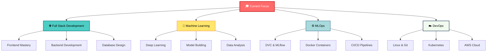
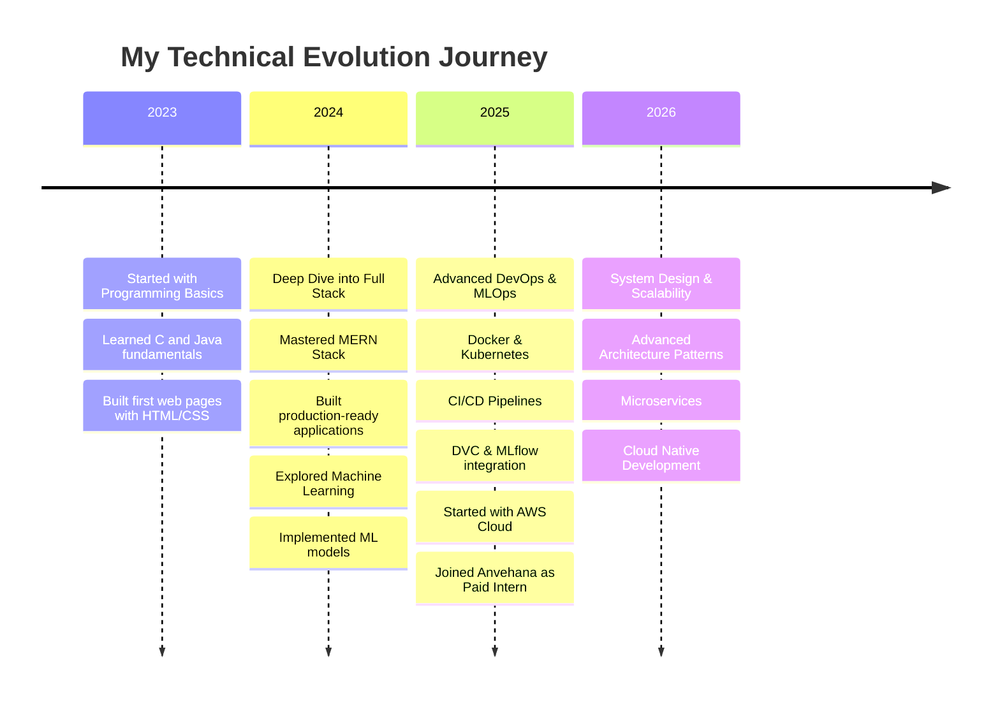

<div align="center">
  
</div>

<div align="center">
  
  [](https://git.io/typing-svg)
  
</div>

<p align="center">
  
  
</p>

---

## 🚀 About Me

```typescript
const kallappa = {
    pronouns: "He/Him",
    currentRole: "Paid Intern @ Anvehana Research Portal",
    company: "REVA University",
    workingOn: "MERN Stack Development",
    location: "India 🇮🇳",
    interests: ["Full Stack Development", "Machine Learning", "MLOps", "Cloud Computing"],
    funFact: "I debug faster when the deadline is closer! ⚡",
    lifePhilosophy: "Code with passion, deploy with confidence!",
    askMeAbout: ["Web Dev", "ML Models", "Docker", "CI/CD Pipelines"],
    currentlyLearning: ["Kubernetes", "AWS", "System Design", "Advanced React Patterns"]
};
```

<div align="center">
  
  ### 💼 Currently Working On
  
  🔹 **Anvehana Research Portal** - MERN Stack Development  
  🔗 [Research Portal](https://researchportal.reva.edu.in/)
  
</div>

---

## 🎯 My Tech Journey

<div align="center">
  


</div>

---

## 🛠️ Tech Stack Arsenal

<div align="center">

### 💻 Languages


### 🎨 Frontend Development


### ⚙️ Backend Development


### 🗄️ Databases


### 🔐 Authentication


### 🤖 Machine Learning & MLOps


### ☁️ DevOps & Cloud


### 🛠️ Tools & Others


</div>

---

## 📊 GitHub Statistics

<div align="center">
   
  
</div>

<div align="center">
  
  
</div>

<div align="center">
  
</div>

---

## 🐍 Contribution Snake

<div align="center">
  <picture>
    <source media="(prefers-color-scheme: dark)" srcset="https://raw.githubusercontent.com/Kallappa2005/Kallappa2005/output/github-contribution-grid-snake-dark.svg">
    <source media="(prefers-color-scheme: light)" srcset="https://raw.githubusercontent.com/Kallappa2005/Kallappa2005/output/github-contribution-grid-snake.svg">
    
  </picture>
</div>

---

## 🎓 My Learning Roadmap

<div align="center">



</div>

---

## 🏆 Expertise Areas

<div align="center">

| Domain | Skills | Proficiency |
|--------|--------|-------------|
| **Full Stack Development** | MERN Stack, REST APIs, Authentication | ⭐⭐⭐⭐⭐ |
| **Machine Learning** | Model Training, Data Processing, MLflow | ⭐⭐⭐⭐ |
| **MLOps** | DVC, Docker, CI/CD, DagsHub | ⭐⭐⭐⭐ |
| **DevOps** | Linux, Git, Docker, Kubernetes, AWS | ⭐⭐⭐ |
| **Database Management** | MongoDB, PostgreSQL, Schema Design | ⭐⭐⭐⭐ |
| **Cloud Computing** | AWS Basics, Deployment Strategies | ⭐⭐⭐ |

</div>

---

## 🌟 Featured Projects

<div align="center">

[](https://github.com/Kallappa2005/Kallappa2005)

</div>

---

## 💭 Developer Quote

<div align="center">


</div>

---

## 📫 Let's Connect & Collaborate

<div align="center">

[](https://linkedin.com/in/kallappa)
[](https://github.com/Kallappa2005)
[](mailto:kallappa@example.com)
[](https://kallappa-portfolio.vercel.app)
[](https://twitter.com/kallappa)

### 💬 Open to:
🚀 **Freelance Projects** | 🤝 **Collaboration** | 💼 **Job Opportunities** | 🎯 **Open Source Contributions**

</div>

---

## 📈 Activity Graph

<div align="center">
  
[](https://github.com/Kallappa2005)

</div>

---

## 🎯 GitHub Metrics

<div align="center">


</div>

---

<div align="center">

### 🌈 "Building innovative solutions, one commit at a time!"

**⭐ Star my repos if you find them interesting!**  
**🍴 Fork and contribute to open source!**  
**💡 Always learning, always growing!**

---

### 🎨 Fun Fact Generator


---


</div>

---

<div align="center">
  
</div>

<div align="center">
  
**"Code • Create • Collaborate • Conquer"** 🚀
  
</div>
